# GCP Healthcare Data Engineering Platform - Landing Zone

## 📖 Overview
This repository contains the Terraform Infrastructure-as-Code (IaC) to bootstrap the **GCP Landing Zone** for the Healthcare Data Engineering Platform. It manages the entire organizational hierarchy, identity, networking, security perimeters, and domain-specific workload projects.

The architecture follows a **Hub-and-Spoke** network model with strict separation of duties between **Shared Services** (DevOps/Orchestration) and **Data Domains** (Clinical, Research, Enterprise).

## 🏗 Architecture
The infrastructure follows a **Hub-and-Spoke** network topology deployed in layers. This ensures a "Defense in Depth" security posture where sensitive data is isolated from the internet and other business units.

* **Identity Foundation (Cloud Identity)**: The authoritative source for Users and Groups.
    * Manages authentication (SSO/MFA) before users reach GCP.
    * Synchronizes with on-prem Active Directory (if applicable).
    * **Note:** We map permissions to *Groups* (e.g., `gcp-data-engineers`), never directly to users.
* **Organization Root**: Top-level policy enforcement (e.g., "No Public IPs", "Trusted Image Sources").

* **Shared Services (The Hub)**: Centralized "Brains" of the platform.  Hosts CI/CD (Cloud Build), Orchestration (Composer/Airflow), and Network Gateways (VPN/Interconnect).
* **Data Domains (The Spokes)**:
    * **Clinical**: High-sensitivity environment (PHI) for `Synthea` data. Requires strict **Internal/External subnet isolation**.
    * **Enterprise**: Corporate data workloads (Finance, HR).
    * **Research**: Discovery sandboxes for data scientists.

### 📂 Resource Hierarchy
The folder structure maps directly to business functions to simplify IAM and Policy inheritance.
🏛️ **[Organization Hierarchy](./org.mmd)** 

```mermaid
graph TD
    %% Nodes and Styles
    Org[GCP Organization]
    
    subgraph Folders
        Shared[📂 Shared Services]
        Health[📂 Healthcare Platform]
    end

    subgraph "Shared Services Domain"
        %% Quotes added around the label text below to fix the syntax error
        PrjSharedNP["PROJECT: prj-lbd-shared-np<br/>(Standards, Airflow, Dataflow)"]
        PrjSharedPD["PROJECT: prj-lbd-shared-pd<br/>(Standards, Airflow, Dataflow)"]
    end

    subgraph "Clinical Domain (Synthea)"
        PrjClinNP["PROJECT: prj-clin-syn-np<br/>(Dev/UAT/QA - 
                                                  BigQuery (Bronze/Silver/Gold), 
                                                    GCS, PubSub)"]
        PrjClinPD["PROJECT: prj-clin-syn-pd<br/>(Prod - 
                                                  BigQuery (Bronze/Silver/Gold), 
                                                    GCS, PubSub)"]
    end

    %% Relationships
    Org --> Shared
    Org --> Health

    Shared --> PrjSharedNP
    Shared --> PrjSharedPD

    Health --> PrjClinNP
    Health --> PrjClinPD

    %% Styling
    classDef org fill:#4285F4,stroke:#333,stroke-width:2px,color:white;
    classDef folder fill:#F4B400,stroke:#333,stroke-width:2px,color:white;
    classDef project fill:#0F9D58,stroke:#333,stroke-width:1px,color:white;
    
    class Org org;
    class Shared,Health folder;
    class PrjSharedNP,PrjSharedPD,PrjClinNP,PrjClinPD project;
```

- **📂 Shared Services**
  - `prj-lbd-shared-np`: Non-Prod tooling (Compute, Airflow, Artifact Registry).
  - `prj-lbd-shared-pd`: Prod tooling (strictly controlled, limited access).
- **📂 Healthcare Platform**
  - **Clinical Domain** (High Security)
    - `prj-clin-syn-np`: Dev/Test/QA environments.
    - `prj-clin-syn-pd`: Production PHI workloads.
  - **Enterprise Domain** (Internal Business)
    - `prj-ent-np` / `prj-ent-pd`: Standard business reporting.
  - **Research Domain** (Discovery)
    - `prj-res-np` / `prj-res-pd`: Sandboxes for ad-hoc analysis.


**[Network Topology](./network.mmd)**

```mermaid
graph TD
    %% =========================================
    %% 1. ON-PREMISE CONNECTIVITY
    %% =========================================
    subgraph OnPrem_Zone [🏢 On-Premise & Interconnect]
        OnPrem[Legacy Data Center<br/>VPN - Direct Connect]
        Interconnect((⚡ Dedicated<br/>Interconnect))
    end

    %% =========================================
    %% 2. THE HUB (Networking Core)
    %% =========================================
    subgraph Hub_Project [PROJECT: prj-net-common-pd-host]
        subgraph Hub_VPC [vpc-hub-main]
            direction TB
            Hub_Subnet["subnet: sb-hub-main-usc1<br/>10.0.0.0/24"]
            Hub_NAT[Cloud NAT - Router]
        end
    end

    %% =========================================
    %% 3. THE SPOKES (Domain Host Projects)
    %% =========================================

    %% --- CLINICAL SPOKE ---
    subgraph Clin_Project [PROJECT: prj-net-clin-pd-host]
        subgraph Clin_VPC [vpc-clin-prod]
            Clin_Subnet_Int["subnet: sb-clin-prod-int-usc1<br/>10.10.1.0/24<br/>🔒 Private-Internal"]
            Clin_Subnet_Ext["subnet: sb-clin-prod-ext-usc1<br/>10.10.2.0/24<br/>🌐 External-Ingress"]
        end
    end

    %% --- ENTERPRISE SPOKE ---
    subgraph Ent_Project [PROJECT: prj-net-ent-pd-host]
        subgraph Ent_VPC [vpc-ent-prod]
            Ent_Subnet["subnet: sb-ent-prod-int-usc1<br/>10.20.1.0/24"]
        end
    end

    %% --- RESEARCH SPOKE ---
    subgraph Res_Project [PROJECT: prj-net-res-pd-host]
        subgraph Res_VPC [vpc-res-prod]
            Res_Subnet["subnet: sb-res-prod-int-usc1<br/>10.30.1.0/24"]
        end
    end

    %% =========================================
    %% CONNECTIONS & PEERING
    %% =========================================

    %% 1. Hybrid Link
    OnPrem === Interconnect
    Interconnect ===|BGP Routing| Hub_NAT

    %% 2. Hub <-> Spoke Peering
    Hub_VPC -.-> |"VPC Peering<br/>Transit"| Clin_VPC
    Hub_VPC -.-> |"VPC Peering<br/>Transit"| Ent_VPC
    Hub_VPC -.-> |"VPC Peering<br/>Transit"| Res_VPC

    %% =========================================
    %% STYLING
    %% =========================================
    classDef onprem fill:#424242,stroke:#000,stroke-width:2px,color:white;
    classDef hubProject fill:#E3F2FD,stroke:#1565C0,stroke-width:2px;
    classDef hubVPC fill:#BBDEFB,stroke:#1976D2,stroke-width:1px;
    classDef spokeProject fill:#F1F8E9,stroke:#558B2F,stroke-width:2px;
    classDef spokeVPC fill:#DCEDC8,stroke:#689F38,stroke-width:1px,stroke-dasharray: 5 5;
    classDef subnet fill:#FFFFFF,stroke:#333,stroke-width:1px;

    class OnPrem,Interconnect onprem;
    class Hub_Project hubProject;
    class Hub_VPC hubVPC;
    class Clin_Project,Ent_Project,Res_Project spokeProject;
    class Clin_VPC,Ent_VPC,Res_VPC spokeVPC;
    class Hub_Subnet,Clin_Subnet_Int,Clin_Subnet_Ext,Ent_Subnet,Res_Subnet subnet;

    %% Highlight the peering links orange
    linkStyle 2,3,4 stroke:#F57C00,stroke-width:3px,stroke-dasharray: 5 5;
```



### 🔒 Network Segmentation & Subnet Isolation
We utilize **Shared VPCs** to separate network administration (NetOps) from application administration (DevOps).

| Domain | Subnet Type | Purpose | Security Control |
| :--- | :--- | :--- | :--- |
| **Shared (Hub)** | **Transit** | Interconnect/VPN termination & Cloud NAT. | All traffic enters/exits here. |
| **Clinical** | **External (DMZ)** | Load Balancers, Ingress proxies. | Allows strictly filtered HTTPS ingress. |
| **Clinical** | **Internal (Trusted)** | Dataflow workers, BigQuery, Compute. | **No Public IPs.** Traffic allowed *only* from DMZ subnet. |
| **Enterprise** | **Internal** | Corporate apps and dashboards. | Private connectivity to on-premise systems. |
| **Research** | **Internal** | Notebook servers (Vertex AI). | Internet access restricted via Proxy/NAT. |

---

## 🧠 Design Justification: Why this structure?

### 1. Security & Compliance (The "Blast Radius")
* **Isolation:** By placing Clinical, Enterprise, and Research in separate Projects (and separate VPCs peered only via the Hub), we ensure that a compromise in the "Research" sandbox cannot laterally move to the "Clinical" database.
* **PHI Protection:** The **2-Tier Subnet Strategy** (External vs. Internal) in the Clinical domain creates a DMZ. Attackers hitting the public edge cannot directly reach the database layer; they must pass through a firewall and a proxy layer first.
* **Least Privilege:** Developers are granted access only to the `prj-clin-syn-np` project, giving them freedom to build without risking network changes (which are locked in the Host Project).

### 2. Ease of Management
* **Network Centralization:** A single "Network Admin" team manages the Host Projects (`prj-net-*`), Firewalls, and Cloud NATs in one place. They don't need to chase down firewall rules scattered across 50 different projects.
* **Cost Transparency:** Because every domain (Clinical vs. Enterprise) has its own Project, the billing invoice is automatically broken down by business unit. No complex tagging strategy is required to know how much "Research" is spending vs. "Operations."
* **Scalability:** Adding a new domain (e.g., "Marketing") is as simple as adding a new Spoke Project and peering it to the Hub. The Hub's VPN/Interconnect setup does not need to be reconfigured.
---

## 📂 Repository Structure

| Directory | Description |
| :--- | :--- |
| **`00-bootstrap`** | Initial setup of the Terraform admin project and state bucket. |
| **`01-organization`** | Manages Folders (`healthcare_platform`, `shared_services`) and Org Policies. |
| **`02-identity`** | Cloud Identity setup, Google Groups, and User IAM bindings. |
| **`03-networking`** | Shared VPCs, Subnets, Cloud NAT, and Peering configurations. |
| **`04-security`** | VPC Service Controls (VPC-SC), Access Context Manager, and Perimeter logic. |
| **`05-domains`** | Platform-level IAM and specific domain policies (e.g., Clean Rooms). |
| **`06-workloads`** | The actual Service Projects (`clin_syn_np`, `shared_pd`) and their API enablement/resource injection. |

---

## 🚀 Deployment Guide

### Prerequisites
1.  **GCP Billing Account** linked to the Organization.
2.  **Terraform >= 1.5.0** installed locally.
3.  **gcloud SDK** authenticated with `roles/resourcemanager.organizationAdmin`.
4.  **Admin Project**: A pre-existing project to host the Terraform state (bootstrapped in step 00).
5.  **Cloud Identity Free**: This provides upto 50 identities more than sufficient for illlustrating our use cases. 

### Step-by-Step Deployment
This platform relies on layered state. You must apply folders in numerical order.

#### 1. Bootstrap (One-time setup)
Creates the bucket for Terraform state and the service account for CI/CD.
```bash
cd infra/00-bootstrap
terraform init
terraform apply


#### 2. Organization & Identity
Sets up the folder structure and IAM groups.
```bash
cd ../01-organization
terraform init
terraform apply

cd ../02-identity
terraform init
terraform apply

cd ../03-networking
terraform init
terraform apply

cd ../04-security
terraform init
terraform apply
```


## Adding a New Domain
To add a new domain (e.g., Research), update the service_projects map in terraform.tfvars:

```
cd ../05-domains
terraform init
terraform apply

research_np = {
  project_id       = "prj-research-np"
  folder_key       = "healthcare_platform"
  host_project_key = "research"
  subnet_key       = "res_main"
  apis = [
    "notebooks.googleapis.com",
    "bigquery.googleapis.com"
  ]
}
```

## Setup Shared Infra for data projects

```
cd ../06-workloads/shared_ops_new
terraform init
terraform apply
```